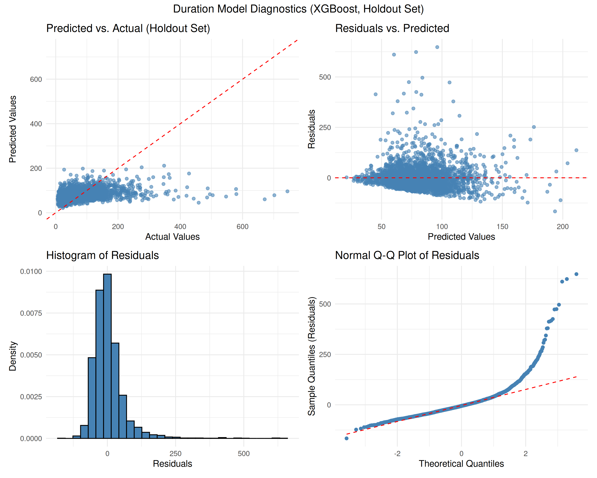
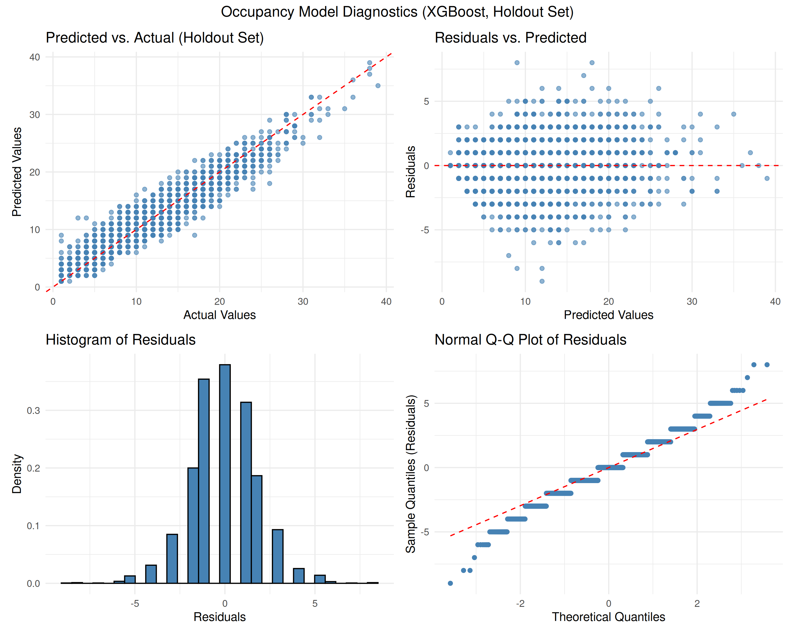
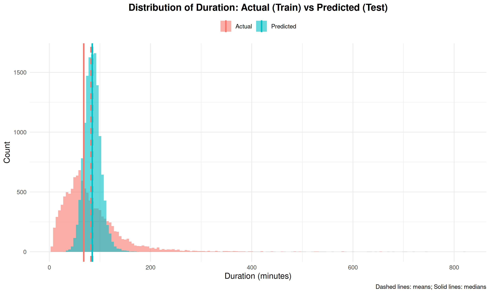
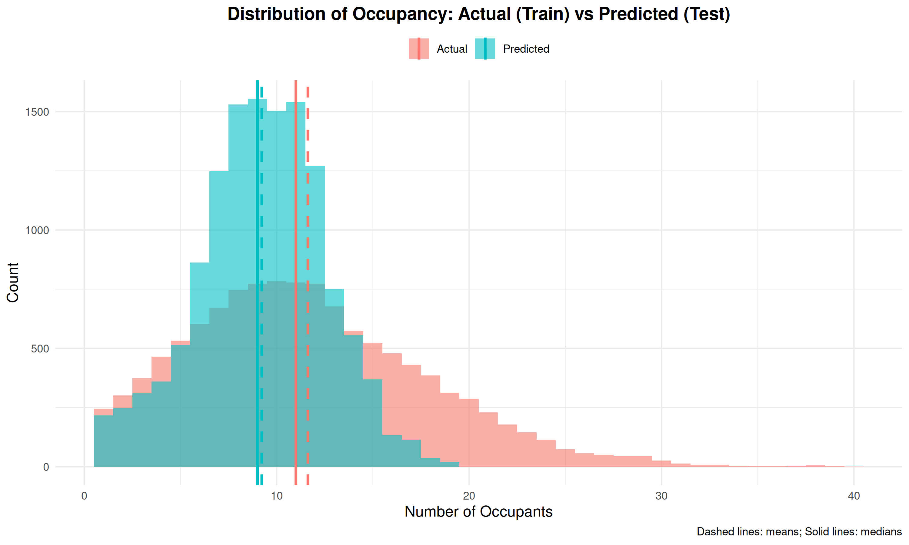
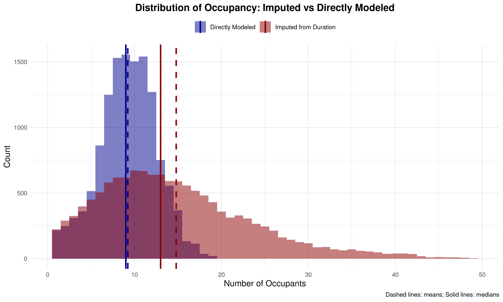

# Evaluation

This section details the performance of our final selected models on the holdout dataset (the 25% of `LC_train` reserved before cross-validation).

## Best Model Configurations

After tuning MARS, Random Forest, XGBoost, MLP, and GRU models using 5-fold cross-validation, XGBoost emerged as the top performer for both prediction tasks.

<table width="100%">
<tr>
<td width="50%" valign="top" style="padding-right: 20px; border-right: 2px solid #ccc;">

### Duration Model (Best on Holdout)

| Component | Configuration |
|-----------|--------------|
| Model | **XGBoost** |
| CV Method | 5-fold |
| Trees | `75` |
| Tree Depth | `21` |
| Learning Rate | `0.05` |
| Min Node Size | `15` |
| Variables Tried (mtry) | `15` |
| Holdout RMSE | `59.9` |
| Holdout R² | `0.099` |

</td>
<td width="50%" valign="top" style="padding-left: 20px;">

### Occupancy Model (Best on Holdout)

| Component | Configuration |
|-----------|--------------|
| Model | **XGBoost** |
| CV Method | 5-fold |
| Trees | `450` |
| Tree Depth | `8` |
| Learning Rate | `0.1` |
| Min Node Size | `2` |
| Variables Tried (mtry) | `35` |
| Holdout RMSE | `1.83` |
| Holdout R² | `0.911` |

</td>
</tr>
</table>

For predicting visit `Duration`, the optimized **XGBoost model** achieved the lowest Root Mean Squared Error (RMSE) on the holdout set compared to the other algorithms tested. The key hyperparameters identified through cross-validation tuning were 75 trees, a maximum tree depth of 21, a learning rate of 0.05, a minimum node size of 15, and sampling 15 variables at each split.

However, the resulting R² value of **0.099** is quite low, indicating that even the best model struggled significantly to explain the variance in individual visit durations. As noted in the presentation, we found that applying a **post-hoc weighted average** (blending the model's prediction with the overall mean training duration) slightly improved practical performance, though the fundamental challenge of predicting this noisy target remains.

The `Occupancy` prediction task yielded much more successful results. Again, **XGBoost** provided the best performance on the holdout data. The optimal configuration used 450 trees, a maximum depth of 8, a learning rate of 0.1, a minimum node size of 2, and sampled 35 variables per split. This model achieved an RMSE of **1.83 students** and a strong R² value of **0.911**, demonstrating its ability to effectively capture the patterns driving building occupancy based on check-in data.

## Model Diagnostics

*(Note: The diagnostic plots shown here are from the final presentation and reflect the performance of the best XGBoost models on the holdout set.)*

### Duration Model Performance (XGBoost)

The diagnostic plots for the best duration model (XGBoost) highlight the difficulties encountered. While better than simpler models explored earlier, the R² of ~0.1 signifies substantial unexplained variance.

- **Predicted vs. Actual**: Shows significant scatter and a tendency for the model to predict within a narrower range than the true values, particularly struggling with very long durations.
- **Residuals vs. Predicted**: Ideally shows no pattern, but here we see variance increase with predicted value (heteroscedasticity) especially from around 45 to 120 in our predicted values, indicating model misspecification.
- **Residual Histogram/QQ Plot**: These plots deviate from normality, especially in the tails, reflecting the model's difficulty with the right skewed nature of duration data and extreme values.

> **Summary:** Predicting individual visit duration remains challenging. The XGBoost model, while the best performer among those tested, still only explains about 10% of the variance (R² ≈ 0.1). The diagnostics show limitations in capturing the full range and variability of visit lengths, potentially due to inherent randomness in individual behavior or missing predictive factors (e.g., specific purpose of visit).

### Occupancy Model Performance (XGBoost)

The **Occupancy model** diagnostics show a much better fit, consistent with the high R² value.

- **Predicted vs. Actual**: Shows points clustering much more closely around the ideal 45-degree line, indicating good agreement between predictions and actual occupancy counts. The integer nature of the data is visible.
- **Residuals vs. Predicted**: While perhaps not perfectly random, the pattern is much less pronounced than for the duration model, suggesting the model captures the primary drivers of occupancy well.
- **Residual Histogram/QQ Plot**: Appear much closer to a normal distribution compared to the duration residuals, although some significant deviations occur at the extremes (very low and very high occupancy).

> **Summary:** The XGBoost model for occupancy prediction performed remarkably well (R² ≈ 0.91). Diagnostics confirm a strong fit, even for high values. The model effectively learned the relationship between the input features (time, student demographics, academic context, etc.) and the number of students currently in the Learning Commons.

## Distribution Analysis

*(Note: The distribution plots shown here are from the final presentation.)*

### Predicted vs. Actual Distributions

Comparing the distributions of predicted versus actual values provides further insight.

- **Duration**: The predicted distribution (blue) for the XGBoost duration model is still more concentrated than the actual distribution (red), reflecting the difficulty in predicting the long tail of very long visits (R² ≈ 0.1). While potentially better than simpler models from last semester, it doesn't fully capture the observed spread.

- **Occupancy**: The predicted distribution aligns interestingly with the actual occupancy counts. While the model performs with a high R² (≈ 0.91), the shape and central tendency of the observed data sits some 2 occupants *lower* than the mean and median at a much higher density, $\sim 2 \times$. This contrasts to our last semester's prediction curve which centered about 1.5 mean occupants *higher* than the training distribution.

### Comparison of Prediction Methods (Occupancy)

*(Note: The presentation included a plot comparing imputed vs. direct occupancy predictions.)*

The visualization below compares direct occupancy prediction (blue), using XGBoost, against an indirect method (red), viz. imputing occupancy based on the XGBoost duration predictions. Direct modeling typically yields better results as it avoids propagating errors from an intermediate prediction step. However, based on the plot, one might think that the imputed curve (red) better aligns with the training occupancy distribution. This observation was noted last semester as well.

> **Insight**: Directly modeling the target variable of interest (Occupancy) proved much more effective than trying to infer it from predictions of a related but harder-to-predict variable (Duration). Our final XGBoost occupancy model significantly outperformed any imputed approaches considered.

## Technical Challenges and Insights

The process of developing these models highlighted several important technical aspects. Predicting individual visit `Duration` proved substantially more difficult than forecasting accumulated `Occupancy`, primarily due to the high variability and pronounced right-skewness inherent in the duration data. This characteristic makes the target challenging for standard regression models.

Our exploration showed that for these specific prediction tasks, the XGBoost algorithm ultimately provided superior performance compared to simpler linear models (MARS), standard Random Forests, and the neural network architectures tested. This suggests that the non-linear relationships and feature interactions effectively captured by gradient boosting were crucial for maximizing predictive accuracy.

Finally, the necessity of careful hyperparameter tuning through cross-validation became evident, as the performance of complex models like XGBoost can be quite sensitive to the chosen settings for parameters like tree depth, learning rate, and regularization.