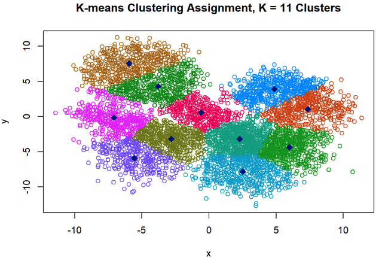
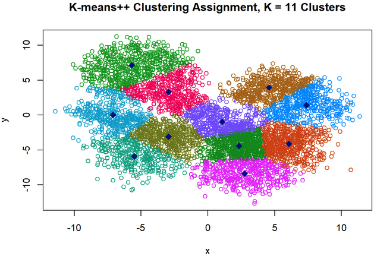
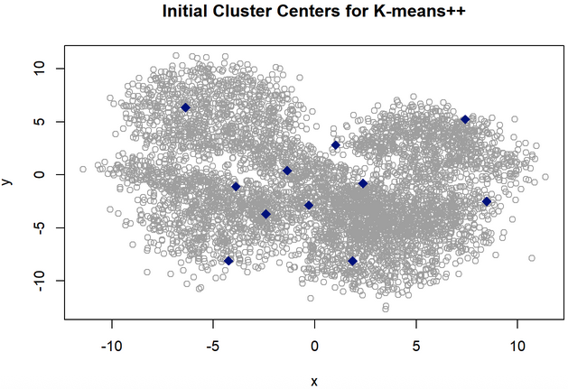

# Kmeans++

## Part B: Creating a K-Means++ Algorithm

```r
set.seed(7560)
km <- read.csv("kmeans_dataset.csv")
kclust <- kmeans(km, centers = 11, nstart = 1)

library(colorspace)
colorset <- hcl(h = seq(0, 300, length.out = 11), c = 150, l = 50) 
plot(km, col = colorset[kclust$cluster],
     main = "K-means Clustering Assignment, K = 11 Clusters")
points(kclust$centers, col = "blue4", pch = 18, cex = 1.5)
```



```r
sum(kclust$withinss)
```

```
## [1] 22824.15
```

```r
kclust$iter
```

```
## [1] 5
```

Though it depends on the choice of seed, running k-means with the seed used here (7560) and using only one starting set of random clusters (`nstart = 1`) yields a within-cluster sum of squares of `22,824.15`. The algorithm took `5` iterations to converge. This metric of cluster compactness might have been lowered further if nstart was increased. 

```r
find_kmeanspp_centers <- function(X, K){

  starting_center <- as.matrix(X)[sample(nrow(X), 1),]
  
  if (K == 1) {
    return(matrix(starting_center, nrow = 1))
    stop
  }
  
  centers <- matrix(NA, nrow = K, ncol = ncol(X), byrow = TRUE)
  centers[1,] <- starting_center
  
  dX <- matrix(rep(starting_center, nrow(X)), nrow = nrow(X), byrow = TRUE)
  dX <- rowSums((X - dX)^2)
  probs <- dX/sum(dX)
  
  K_ind <- 1
  while (K > K_ind) {
    K_ind <- K_ind + 1
    
    centers[K_ind,] <- as.matrix(X)[sample(nrow(X), 1, prob = probs),]
    
    dC <- sapply(1:K_ind, function(i) {
      dclust <- matrix(centers[i,], nrow = nrow(X), ncol = ncol(X), byrow = TRUE)
      rowSums((X - dclust)^2)
    })
    
    mindist <- dC[cbind(1:nrow(dC), max.col(-dC, ties.method = "random"))]
    probs <- mindist/sum(mindist)
  }
  
  return(centers)
}
```

```r
set.seed(7560)
ppcenters <- find_kmeanspp_centers(km, K = 11)

#Sanity check: Are 'pluspluscenters' actual observations?
center_indices <- apply(ppcenters, 1, function(row) {
  which(apply(km, 1, function(x) all(x == row)))
})
isTRUE(all(km[center_indices,] == ppcenters))
```

```
## [1] TRUE
```

```r
kclustpp <- kmeans(km, centers = ppcenters, nstart = 1)
plot(km, col = colorset[kclustpp$cluster],
     main = "K-means++ Clustering Assignment, K = 11 Clusters")
points(kclustpp$centers, col = "blue4", pch = 18, cex = 1.5)
```



```r
sum(kclustpp$withinss)
```

```
## [1] 22942.74
```

```r
kclustpp$iter
```

```
## [1] 8
```

K-means++ actually performs slightly worse, with a within-cluster sum of squares of `22,942.74` and a total of `8` iterations needed for the k-means algorithm to converge after the starting cluster centers were obtained. Visual inspection of the clusters does not suggest that k-means++ failed, rather it just incidentally produced slightly less compact clusters. Again, the k-means++ algorithm is subject to randomness and a different choice of seed might have yielded better results.

Because the data set is large and consists of points that lie within a relatively small subset of $\mathbb{R}^2$, the starting point selection for k-means++, which is based on distance-proportional probability, is close to a random selection of points, because each point's probability of being selected as the next cluster center is almost 0 regardless of the point's distance from the existing cluster centers (for this data set, the average probability of a point being selected as the next cluster is close to `1/nrow(km)` $\approx$ 0.00018).

The need for additional iterations in the k-means++ algorithm confirms that the distance-proportional probability selection of initial cluster centers was not especially helpful for clustering this data set; there is no gain in converge speed because the initial cluster centers with the seed used (7560) are not especially good, and the algorithm needs a few more iterations to converge.

```r
plot(km, col = "darkgray", main = "Initial Cluster Centers for K-means++")
points(ppcenters, col = "blue4", pch = 18, cex = 1.5)
```


