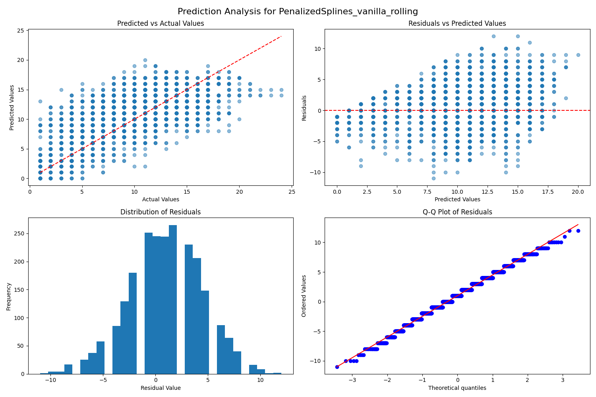
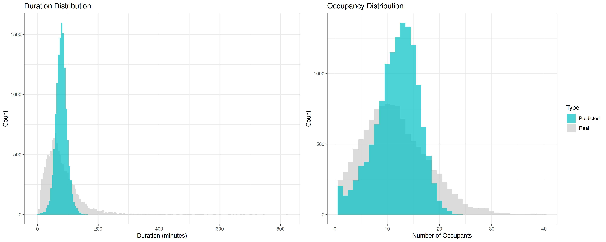

# **Evaluation**

## Best Model Configurations

<table width="100%">
<tr>
<td width="50%" valign="top" style="padding-right: 20px; border-right: 2px solid #ccc;">

### Duration Model

| Component | Configuration |
|-----------|--------------|
| Model | **_PenalizedSplines_** |
| Pipeline | **_vanilla_** |
| CV Method | **_kfold_** |
| Ridge α | `14.38` |
| Spline knots | `15` |
| Scaler | **_RobustScaler_** |
| RMSE | `59.47` |
| R² | `0.059` |

</td>
<td width="50%" valign="top" style="padding-left: 20px;">

### Occupancy Model

| Component | Configuration |
|-----------|--------------|
| Model | **_PenalizedSplines_** |
| Pipeline | **_vanilla_** |
| CV Method | **_rolling_** |
| Ridge α | `29.76` |
| Spline knots | `15` |
| Scaler | **_RobustScaler_** |
| RMSE | `3.64` |
| R² | `0.303` |

</td>
</tr>
</table>

For predicting the `Duration` target variable, we implemented a **_Penalized Cubic Spline model_** with 15 knots. Despite extensive testing of various approaches, including **_feature interactions_** and **_compression techniques_**, the vanilla pipeline consistently outperformed more complex alternatives. Notably, **_temporal cross-validation_** showed no meaningful advantage over the random KFold method. After thorough hyperparameter optimization, we determined the optimal Ridge penalty to be `14.38`.

Note: While this model achieved the **_lowest RMSE_** among all tested approaches, its low R² value of `0.059` indicates a **_significant limitation_** in explaining the variance in the response variable.

The `Occupancy` prediction results proved more encouraging. Using another **_Penalized Cubic Spline model_** with 15 knots, we found that **_rolling cross-validation_** provided superior results compared to other methods. Through systematic tuning, we identified an optimal Ridge penalty of `29.76`. The resulting R² value of `0.303`, while modest, represents a **_meaningful improvement_** over the Duration model and suggests better capture of the underlying patterns in the data.

## Model Diagnostics

### Duration Model Performance

The diagnostic plots below visually evaluate the performance of the model in predicting the `Duration` response variable. As noted earlier, the model struggles to explain the variance in the response. These plots compare actual and predicted values and provide insights into the residuals.

In the first scatter plot, the model's predictions are **_capped off just under roughly 150_**, leading to a horizontal cluster of points. This consistent **_underestimation of larger responses_** is further reflected in the residual histogram, which has an extended left tail, and the residual QQ plot, where many negative residuals deviate significantly below the normal reference line. Additionally, the residual plot reveals **_non-constant variance_** and a distinct pattern, indicating that the model fails to capture the true underlying structure of the data.

> **Summary:** The duration prediction task proved particularly challenging, with models struggling to capture the full range of visit durations. The low R² value reflects the **_inherent complexity_** of predicting individual study session lengths. Our models consistently produced a **_compressed prediction range_**, systematically underestimating visits longer than `150` minutes while overestimating very short durations. This behavior suggests that additional features or alternative modeling approaches may be necessary to capture the full spectrum of study patterns.

### Occupancy Model Performance

The **_Occupancy model_** diagnostics reveal more promising results. The scatter plots exhibit a distinct **_grid-like pattern_** due to the integer nature of both the response variable and the model's predictions. Areas where multiple points share the same value appear as darker shades of blue in the scatter plots.

Consistent with the improved R² observed for this model, the diagnostic plots reflect a **_better overall fit_** compared to the Duration model. Although a slight pattern is still visible in the residual plot, it is evident that this model aligns more closely with the underlying data for this problem.

> **Summary:** The occupancy prediction models demonstrated substantially better performance, particularly in capturing **_typical usage patterns_**. The models showed strongest accuracy in the **_modal range of 10-15 occupants_**, where most observations occur. While the overall distribution of predictions closely matched observed patterns, we observed minor discrepancies at the distribution tails, particularly during **_extremely busy or quiet periods_**. The superior R² value suggests that occupancy patterns follow more predictable trends than individual visit durations.

## Distribution Analysis

### Predicted vs. Actual Distributions

To further evaluate the predictive performance of our models, we overlaid the distribution of predicted values onto histograms of the actual values. These plots provide a clearer depiction of how well our predictions align with the actual data. In both cases, the models appear to consistently **_overshoot the bulk of the observations_**. We suspect this overestimation is driven by the presence of **_extreme high values_** in the dataset, which the models struggled to accurately predict.

This challenge likely contributes to the relatively **_high RMSE_** for our `Duration` model. Large errors on these extreme values significantly inflate the RMSE, as it averages the squared differences across all predictions.

The distribution comparisons above reveal distinct patterns for each response variable. For Duration (left panel), the predicted distribution (blue) exhibits **_notably less spread_** than the actual values (gray), with a pronounced peak near the mean. This compression of the predicted range manifests in consistent **_underestimation of extreme durations_**, particularly evident in the model's inability to capture values beyond `150` minutes. These limitations align with our earlier observations of the model's **_low R² (`0.059`)_** and **_elevated RMSE (`59.47`)_**.

The Occupancy predictions (right panel) show **_more promising results_**. The predicted distribution more faithfully reproduces the actual data's shape, particularly in the **_modal range of 10-15 occupants_**. However, some discrepancies persist at the extremes, with slight underestimation of low occupancy values and incomplete capture of the upper range. These characteristics explain the **_moderate R² value of `0.303`_**, suggesting our model captures meaningful but incomplete patterns in the occupancy data.

### Comparison of Prediction Methods

The visualization below compares two distinct approaches to occupancy prediction: **_direct modeling_** using Penalized Splines and **_imputation based on Duration predictions_**. The imputation method estimates occupancy as a derived variable from Duration predictions, while our primary model targets occupancy directly through Penalized Splines optimization.

This comparison reveals **_notable distributional differences_**. The direct modeling approach (shown in blue) demonstrates **_superior alignment_** with actual occupancy patterns, particularly in capturing the characteristic peak at 10-15 occupants. In contrast, the imputed predictions (shown in red) produce a **_more diffuse distribution_** with extended tails, suggesting systematic overestimation of extreme occupancy values. We attribute this overestimation to **_error propagation_** from the underlying Duration predictions.

These results underscore a critical methodological insight: while imputation offers a practical alternative when direct measurements are unavailable, it introduces **_additional uncertainty_** compared to models trained explicitly on the target variable. The superior performance of our direct **_Penalized Splines approach_** validates our decision to prioritize dedicated occupancy modeling.

## Technical Challenges and Insights

Our modeling process revealed several key technical challenges that influenced our approach and results:

### Distribution Complexity
The underlying distributions of our target variables presented significant modeling challenges. `Duration` data exhibited strong **_right-skew characteristics_**, requiring careful consideration of transformation approaches. While **_log-normal transformations_** improved model training stability, they introduced complications in error interpretation on the original scale. The discrete nature of occupancy counts necessitated specialized handling, leading to our implementation of the `RoundedRegressor` wrapper to maintain prediction integrity.

### Model Architecture Considerations
Our systematic evaluation of model architectures yielded an unexpected insight: the **_vanilla pipeline_** consistently outperformed more sophisticated approaches. This finding suggests that:

1. The relationship between our features and targets may be more **_direct than initially hypothesized_**
2. The additional complexity of **_interaction terms_** and **_dimensionality reduction_** might be introducing noise rather than capturing meaningful patterns
3. The superior performance of simpler architectures indicates that careful **_feature engineering_** may be more valuable than architectural sophistication

### Temporal Pattern Significance
The impact of temporal patterns emerged as a crucial factor, particularly in occupancy prediction. **_Rolling cross-validation_** consistently outperformed static approaches, suggesting that:

- Recent historical patterns carry strong **_predictive power_**
- The relationship between features and occupancy **_evolves over time_**
- Traditional **_k-fold validation_** may underestimate model performance in practical applications

These insights have shaped our recommendations for future work and system deployment.

## Conclusions

### Key Findings

Our analysis demonstrates that **_Penalized Cubic Spline models_** delivered the strongest performance for both `Duration` and `Occupancy` predictions. We are particularly satisfied with the **_Occupancy model's capabilities_** and look forward to benchmarking it against our peers' approaches.

### Future Directions

This project's scope was necessarily limited to the provided features. We believe incorporating **_external variables_** could substantially improve model performance. For instance, the timestamp data suggests an opportunity to integrate **_weather conditions_**, which likely influence Learning Commons usage patterns.

Additionally, while the models covered in this course offered valuable insights, alternative approaches such as **_tree-based methods_** or **_neural networks_** might better capture the complex non-linear relationships we observed. Given the clear **_temporal dependencies_** in our target variables, time series modeling presents another promising avenue for investigation.