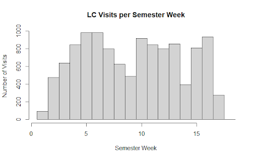

# **Feature Engineering**

The complete feature engineering implementation can be found in our [source code](https://github.com/adabwana/f24-m7550-final-project/blob/master/src/r/feature_engineering.R).

## Temporal Feature Engineering

Our feature engineering process began with **_temporal data extraction_** using the `lubridate` package. The timestamp data provided several readily constructible features:

```r
prepare_dates <- function(df) {
 df %>% mutate(
   Check_In_Date = mdy(Check_In_Date),
   Check_In_Time = hms::as_hms(Check_In_Time)
 )
}
```

From these validated timestamps, we construct several temporal features:

```r
add_temporal_features <- function(df) {
 df %>% mutate(
    Check_In_Day = wday(Check_In_Date, label = TRUE),
    Is_Weekend = Check_In_Day %in% c("Sat", "Sun"),
    Check_In_Week = ceiling(day(Check_In_Date) / 7),
    Check_In_Month = month(Check_In_Date, label = TRUE),
    Check_In_Hour = hour(Check_In_Time)
 )
}
```

Analysis of visit patterns revealed a **_non-linear relationship_** between `Check_In_Hour` and `Duration` variables. This observation prompted the creation of a more nuanced `Time_Category` variable with distinct periods:

```r
add_time_category <- function(df) {
 df %>% mutate(
   Time_Category = case_when(
       hour(Check_In_Time) < 6 ~ "Late Night",
       hour(Check_In_Time) < 12 ~ "Morning",
       hour(Check_In_Time) < 17 ~ "Afternoon",
       hour(Check_In_Time) < 22 ~ "Evening",
       TRUE ~ "Late Night"
   )
 )
}
```

The `Expected_Graduation` variable presented a **_dimensionality challenge_** due to its categorical semester format. We addressed this by converting it to a numeric **_'Months_Until_Graduation'_** metric, effectively reducing complexity while maintaining predictive potential.

```r
convert_semester_to_date <- function(semester_str) {
   parts <- strsplit(semester_str, " ")[[1]]
   year <- parts[length(parts)]
   semester <- parts[1]
   month <- case_when(
      semester == "Fall" ~ "08",
      semester == "Spring" ~ "01",
      semester == "Summer" ~ "06",
      semester == "Winter" ~ "12",
      TRUE ~ NA_character_
   )
   paste0(month, "/", "01", "/", year)
}
```

```r
add_graduation_features <- function(df) {
   df %>% mutate(
      Months_Until_Graduation = as.numeric(
         difftime(Expected_Graduation_Date, Semester_Date, units = "days") / 30.44
      )
   )
}
```

## Course-Related Features

The `Course_Code_by_Thousands` variable exhibited significant ambiguity when treated categorically. Our analysis indicated the need for a more structured approach, leading to the following **_classification systems_**:

```r
add_course_related_features <- function(df) {
  df %>% mutate(
    Course_Level = case_when(
      Course_Code_by_Thousands <= 100 ~ "Special",
      Course_Code_by_Thousands <= 3000 ~ "Lower Classmen",
      Course_Code_by_Thousands <= 4000 ~ "Upper Classmen",
      Course_Code_by_Thousands > 4000 ~ "Graduate"
    )
  )
}
```

To capture academic performance context, we developed categorical features for `GPA` and `Credit_Load`:

```r
add_academic_performance_features <- function(df) {
  df %>% mutate(
    GPA_Category = case_when(
      GPA >= 3.5 ~ "Excellent",
      GPA >= 3.0 ~ "Good",
      GPA >= 2.0 ~ "Satisfactory",
      TRUE ~ "Needs Improvement"
    )
  )
}
```

```r
add_credit_load_features <- function(df) {
  df %>% mutate(
   Credit_Load_Category = case_when(
     Credit_Load <= 6 ~ "Part Time",
     Credit_Load <= 12 ~ "Half Time",
     Credit_Load <= 18 ~ "Full Time",
     TRUE ~ "Overload"
    )
  )
}
```

## Student Classification Features

The dataset exhibited an **_unexpected concentration_** of '_Senior_' classifications in our initial analysis. Further investigation revealed this stemmed from students accumulating excess credits for senior status without fulfilling graduation requirements. To address this imbalance while preserving useful information, we implemented a **_dual classification approach_**.

```r
add_class_standing_category <- function(df) {
  df %>% mutate(
    # Renaming column and values for Class_Standing
    Class_Standing_Self_Reported = case_when(
      Class_Standing == "Freshman" ~ "First Year",
      Class_Standing == "Sophomore" ~ "Second Year",
      Class_Standing == "Junior" ~ "Third Year",
      Class_Standing == "Senior" ~ "Fourth Year",
      TRUE ~ Class_Standing
    ),
  )
}
```

The original `Class_Standing` variable, while potentially containing valuable self-reported insights, required recoding. We preserved this information as `Class_Standing_Self_Reported` with progression labels from "_First Year_" through "_Fourth Year_", along with "_Graduate_" and "_Other_" designations. Complementing this, we developed a more **_objective BGSU Standing metric_** based on credit hours. This dual approach preserves potentially valuable self-reported information while introducing a more objective credit-based metric.

```r
add_class_standing_bgsu <- function(df) {
  df %>% mutate(
    # Class_standing by BGSU's definition
    # https://www.bgsu.edu/academic-advising/student-resources/academic-standing.html
    Class_Standing_BGSU = case_when(
      Total_Credit_Hours_Earned < 30 ~ "Freshman",
      Total_Credit_Hours_Earned < 60 ~ "Sophomore",
      Total_Credit_Hours_Earned < 90 ~ "Junior",
      Total_Credit_Hours_Earned <= 120 ~ "Senior",
      TRUE ~ "Extended"
    ),
  )
}
```

## Course Name and Type Features

The `Course_Name` variable presented **_immediate challenges_** for model fitting in its raw form. While various approaches existed for handling this **_high-cardinality variable_**, we opted for a **_flexible keyword-based system_**. This approach identifies key terms within course names - for instance, classifying courses containing '_Culture_', '_Language_', or '_Ethics_' under '_Humanities_'. Though this resulted in 14 distinct categories, it provides flexibility for subsequent modeling decisions through **_regularization or variable selection_**.

```r
add_course_name_category <- function(df) {
  df %>% mutate(
    Course_Name_Category = case_when(
      # Introductory level courses
      grepl("Algebra|Basic|Elementary|Intro|Introduction|Fundamental|General|Principles|Orientation", 
            Course_Name, ignore.case = TRUE) ~ "Introductory",
      
      # Intermediate level courses
      grepl("Intermediate|II$|II |2|Applied", 
            Course_Name, ignore.case = TRUE) ~ "Intermediate",
      
      # Advanced level courses
      grepl("Advanced|III|3|Analysis|Senior|Graduate|Dissertation|Research|Capstone", Course_Name, ignore.case = TRUE) ~ "Advanced",
      
      # Business related courses
      grepl("Business|Finance|Accounting|Economics|Marketing|Management", 
            Course_Name, ignore.case = TRUE) ~ "Business",
      
      # Laboratory/Practical courses
      grepl("Laboratory|Lab", Course_Name, ignore.case = TRUE) ~ "Laboratory",
      
      # Seminar/Workshop courses
      grepl("Seminar|Workshop", Course_Name, ignore.case = TRUE) ~ "Seminar",
      
      # Independent/Special courses
      grepl("Independent|Special", Course_Name, ignore.case = TRUE) ~ "Independent Study",
      
      # Mathematics and Statistics
      grepl("Mathematics|Calculus|Statistics|Probability|Geometry|Discrete", 
            Course_Name, ignore.case = TRUE) ~ "Mathematics",
      
      # Computer Science
      grepl("Computer|Programming|Data|Software|Network|Database|Algorithm", 
            Course_Name, ignore.case = TRUE) ~ "Computer Science",
      
      # Natural Sciences
      grepl("Physics|Chemistry|Biology|Astronomy|Earth|Environment|Science", 
            Course_Name, ignore.case = TRUE) ~ "Natural Sciences",
      
      # Social Sciences
      grepl("Psychology|Sociology|Anthropology|Social|Cultural|Society", 
            Course_Name, ignore.case = TRUE) ~ "Social Sciences",
      
      # Humanities
      grepl("History|Philosophy|Ethics|Literature|Culture|Language|Art", 
            Course_Name, ignore.case = TRUE) ~ "Humanities",
      
      # Education/Teaching
      grepl("Education|Teaching|Learning|Childhood|Teacher|Curriculum", 
            Course_Name, ignore.case = TRUE) ~ "Education",
      
      # Default case
      TRUE ~ "Other"
    )
  )
}
```

Similarly, the `Course_Type` variable required **_substantial level reduction_**. We consolidated the original categories into **_natural academic groupings_** such as '_business courses_', '_education courses_', and '_STEM courses_'. For visits lacking course specifications, we designated a "_No Response_" category rather than discarding these observations.

```r
add_course_type_category <- function(df) {
  df %>% mutate(
    Course_Type_Category = case_when(
      # STEM Fields
      Course_Type %in% c("MATH", "STAT", "CS", "ASTR","PHYS", "BIOL", "CHEM", "GEOL", "ECET") ~ "STEM Core",
      
      # Engineering and Technology
      Course_Type %in% c("ENGT", "CONS", "ARCH", "MIS", "TECH") ~ "Engineering & Technology",
      
      # Business and Economics
      Course_Type %in% c("FIN", "ACCT", "ECON", "BA", "MGMT", "MKT", "MBA", "BIZX", "LEGS", "OR") ~ "Business",
      
      # Social Sciences
      Course_Type %in% c("SOC", "PSYC", "POLS", "CRJU", "HDFS", "SOWK", "GERO") ~ "Social Sciences",
      
      # Natural and Health Sciences
      Course_Type %in% c("NURS", "MLS", "EXSC", "FN", "AHTH", "DHS") ~ "Health Sciences",
      
      # Humanities and Languages
      Course_Type %in% c("HIST", "PHIL", "ENG", "GSW", "FREN", "GERM", "SPAN", "LAT", "RUSN", "ITAL", "CLCV") ~ "Humanities",
      
      # Arts and Performance
      Course_Type %in% c("ART", "ID", "MUCT", "MUS", "THFM", "POPC") ~ "Arts",
      
      # Education and Teaching
      Course_Type %in% c("EDTL", "EDFI", "EDIS", "EIEC") ~ "Education",
      
      # Environmental Studies
      Course_Type %in% c("ENVS", "GEOG", "SEES") ~ "Environmental Studies",
      
      # Special Programs
      Course_Type %in% c("HNRS", "UNIV", "ORGD", "RESC") ~ "Special Programs",
      
      # Physical Education
      Course_Type %in% c("PEG", "SM", "HMSL") ~ "Physical Education",
      
      # Cultural Studies
      Course_Type %in% c("ETHN", "COMM", "CDIS") ~ "Cultural & Communication Studies",
      
      # No Response/Unknown
      Course_Type %in% c("No Response", NA) ~ "No Response",
      
      # Default case
      TRUE ~ "Other"
    )
  )
}
```

For visits without a specified course association, we introduced a "**_No Response_**" category to maintain data completeness.

## Major Categories

The `Major` variable demanded a similar **_keyword-based reduction strategy_** as `Course_Name`. Through analysis of major descriptions, we identified **_recurring terms_** that allowed for logical grouping. For example, the '_Mathematics_' category encompasses mathematics, statistics, and actuarial science majors. Our final categorization includes:

```r
add_major_category <- function(df) {
  df %>% mutate(
    Major_Category = case_when(
      # Business and Management
      grepl("MBA|BSBA|Business|Marketing|Finance|Account|Economics|Management|Supply Chain|Analytics", 
            Major, ignore.case = TRUE) ~ "Business",
      
      # Computer Science and Technology
      grepl("Computer|Software|Data|Information Systems|Technology|Engineering|Electronics", 
            Major, ignore.case = TRUE) ~ "Computing & Technology",
      
      # Natural Sciences
      grepl("Biology|Chemistry|Physics|Science|Environmental|Geology|Forensic|Neuroscience", 
            Major, ignore.case = TRUE) ~ "Natural Sciences",
      
      # Health Sciences
      grepl("Nursing|Health|Medical|Nutrition|Dietetics|Physical Therapy|Physician|Laboratory", 
            Major, ignore.case = TRUE) ~ "Health Sciences",
      
      # Social Sciences
      grepl("Psychology|Sociology|Criminal Justice|Political|Economics|Social Work|Anthropology", 
            Major, ignore.case = TRUE) ~ "Social Sciences",
      
      # Education
      grepl("Education|Teaching|Early Childhood|BSED|Intervention Specialist", 
            Major, ignore.case = TRUE) ~ "Education",
      
      # Arts and Humanities
      grepl("Art|Music|Philosophy|History|English|Language|Communication|Media|Journalism|Film|Theatre", 
            Major, ignore.case = TRUE) ~ "Arts & Humanities",
      
      # Mathematics and Statistics
      grepl("Math|Statistics|Actuarial", 
            Major, ignore.case = TRUE) ~ "Mathematics",
      
      # Pre-Professional Programs
      grepl("Pre-|PRELAW|PREMED|PREVET", 
            Major, ignore.case = TRUE) ~ "Pre-Professional",
      
      # Undecided/General Studies
      grepl("Undecided|Liberal Studies|General|Deciding|UND|Individual|BLS", 
            Major, ignore.case = TRUE) ~ "General Studies",
      
      # Special Programs
      grepl("Minor|Certificate|GCERT|Non-Degree", 
            Major, ignore.case = TRUE) ~ "Special Programs",
      
      # No Response/Unknown
      grepl("No Response|NA", Major, ignore.case = TRUE) ~ "No Response",
      
      # Default case
      TRUE ~ "Other"
    ),
    
    # Add a flag for double majors
    Has_Multiple_Majors = grepl(",", Major)
  )
}
```

We maintained an '_Other_' category for majors that defied clear classification. The data structure also revealed an opportunity to identify students pursuing **_multiple degrees_** - we created this indicator by detecting comma-separated entries in the `Major` field.

## Visit Pattern Features

`Student_ID` analysis enabled the construction of several **_usage metrics_**. Beyond simple visit counts, we examined **_temporal patterns_** at multiple scales:

```r
add_visit_features <- function(df) {
  df %>%
    group_by(Student_IDs) %>%
    mutate(
      # Count visits per student
      Total_Visits = n(),
      # Count visits per student per semester
      Semester_Visits = n_distinct(Check_In_Date),
      # Average visits per week
      Avg_Weekly_Visits = Semester_Visits / max(Semester_Week)
    ) %>%
    ungroup()
}
```

```r
add_week_volume_category <- function(df) {
  df %>%
    mutate(
      Week_Volume = case_when(
        Semester_Week %in% c(4:8, 10:13, 15:16) ~ "High Volume",
        Semester_Week %in% c(1:3, 9, 14, 17) ~ "Low Volume",
        TRUE ~ "Other"
      )
    )
}
```

Examination of visit frequency throughout the semester revealed **_clear patterns_**. Weeks 1-3, 9, 14, and 17 consistently showed lower activity levels, while the remaining weeks demonstrated higher traffic. This distinction proved valuable, as visit volume may influence individual visit duration. We encoded this insight through a **_binary 'Volume' indicator_** for each week.



## Course Load and Performance Features

For each student-semester combination, we developed metrics to capture **_academic context_**. We tracked the number of unique courses and examined the distribution of course levels based on the `Course_Code_by_Thousands` variable. Particular attention was paid to **_upper-division coursework_**, creating a specific metric for the proportion of '_4000-level courses_'. Additionally, we implemented a **_GPA trend indicator_** that focuses on directional changes rather than absolute values, recognizing that the direction of GPA movement might be more informative than the magnitude.

```r
add_course_load_features <- function(df) {
  df %>%
    group_by(Student_IDs, Semester) %>%
    mutate(
      # Number of unique courses
      Unique_Courses = n_distinct(Course_Number),
      # Mix of course levels
      Course_Level_Mix = n_distinct(Course_Code_by_Thousands),
      # Proportion of advanced courses
      Advanced_Course_Ratio = mean(Course_Level == "Upper Classmen", na.rm = TRUE)
    ) %>%
    ungroup()
}
```

```r
add_gpa_trend <- function(df) {
  df %>% mutate(
    # Calculate GPA trend (1 for positive, -1 for negative, 0 for no change)
    GPA_Trend = sign(Change_in_GPA),
  )
}
```

## Group Dynamics

A final analytical step involved identifying **_group study patterns_**. By examining clusters of `Check_In_Time`, we detected multiple students arriving within the same minute - a strong indicator of group visits. This observation led to three complementary features: `Group_Size`, `Group_Check_In`, and `Group_Size_Category`.

```r
add_group_features <- function(df) {
  df %>%
    mutate(
      Check_In_Timestamp = ymd_hms(paste(Check_In_Date, Check_In_Time))
    ) %>%
    add_count(Check_In_Timestamp, name = "Group_Size") %>%
    mutate(
      Group_Check_In = Group_Size > 1,
      Group_Size_Category = case_when(
        Group_Size == 1 ~ "Individual",
        Group_Size <= 3 ~ "Small Group",
        Group_Size <= 6 ~ "Medium Group",
        TRUE ~ "Large Group"
      )
    ) %>%
    select(-Check_In_Timestamp)
}
```

While some simultaneous check-ins might be coincidental, this classification captures potential **_social patterns_** in Learning Commons usage, particularly among friend groups.

## Data Quality of `Duration` and `Occupancy`

Last, our preprocessing included **_essential validation steps_**. We verified `Duration_In_Min` calculations through comparison of check-in and check-out times, ensuring no negative values existed in the data. The `Occupancy` variable was calculated and received similar scrutiny during its construction.

```r
ensure_duration <- function(df) {
  # Calculate duration in minutes
  df %>%
    mutate(
      Duration_In_Min = as.numeric(difftime(
        Check_Out_Time,
        Check_In_Time,
        units = "mins"
      )),
      # Filter out negative durations
      Duration_In_Min = if_else(Duration_In_Min < 0, NA_real_, Duration_In_Min),
    ) %>%
    filter(!is.na(Duration_In_Min))
}
```

```r
calculate_occupancy <- function(df) {
  df %>%
    arrange(Check_In_Date, Check_In_Time) %>%
    group_by(Check_In_Date) %>%
    mutate(
      Cum_Arrivals = row_number(),
      Cum_Departures = sapply(seq_along(Check_In_Time), function(i) {
        sum(!is.na(Check_Out_Time[1:i]) & 
            Check_Out_Time[1:i] <= Check_In_Time[i])
      }),
      Occupancy = Cum_Arrivals - Cum_Departures
    ) %>%
    select(-c(Cum_Arrivals, Cum_Departures))
}
```

## Conclusion

Our feature engineering process addressed several key challenges in the Learning Commons dataset through **_systematic transformation_** and **_enrichment_** of the raw data. The **_temporal features_** capture both cyclical patterns and academic calendar effects, while our treatment of course-related variables reduces dimensionality while preserving meaningful distinctions. The **_dual approach_** to student classification acknowledges both institutional definitions and self-reported status, providing complementary perspectives on academic progression.

The **_keyword-based categorization systems_** for `Course_Name`, `Course_Type`, and `Major` strike a balance between granularity and model practicality. While some nuance is inevitably lost in such consolidation, the resulting features maintain interpretability while reducing sparsity. The **_visit pattern features_** capture both individual usage trends and broader facility utilization patterns, providing context for duration prediction.

Our treatment of **_group dynamics_** represents a novel approach to capturing social patterns in academic space utilization. While the simultaneous check-in heuristic may occasionally misclassify coincidental arrivals, it provides valuable insight into **_collaborative learning patterns_** that might influence visit duration.

The extensive **_validation steps_** for `Duration_In_Min` and `Occupancy` calculations ensure data quality while acknowledging practical limitations. These features form a robust foundation for subsequent modeling efforts, though opportunities exist for further refinement through domain expert consultation and iterative testing.

