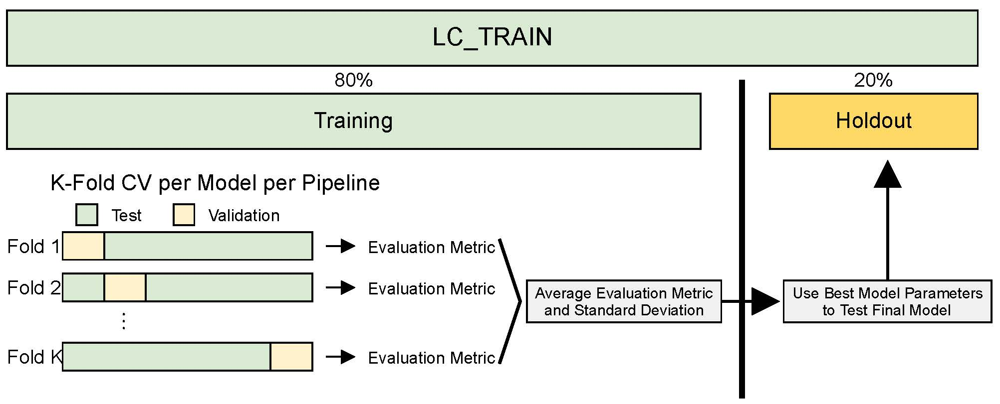
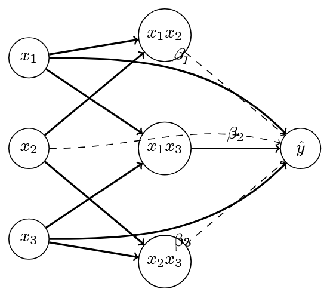

# **Models & Pipelines**

## Framework Architecture

The modeling framework implements **_prediction pipelines_** that operate on the engineered features described in the previous chapter. The implementation resides in the `src/python/models` directory: [`algorithms_duration.py`](https://github.com/adabwana/f24-m7550-final-project/blob/master/src/python/models/algorithms_duration.py), [`algorithms_occupancy.py`](https://github.com/adabwana/f24-m7550-final-project/blob/master/src/python/models/algorithms_occupancy.py), [`pipelines.py`](https://github.com/adabwana/f24-m7550-final-project/blob/master/src/python/models/pipelines.py), and [`cross_validation.py`](https://github.com/adabwana/f24-m7550-final-project/blob/master/src/python/models/cross_validation.py).

## Cross-Validation Methodology

Our prediction framework operates on two complementary datasets: `LC_train`, containing both features and response variables, and `LC_test`, containing only features. The validation process begins with a **_strategic partition_** of `LC_train` into training and holdout segments, allocating 80% and 20% of the data respectively.

The training segment serves as the foundation for **_model development_** through cross-validation. During this phase, we systematically evaluate different **_model architectures_**, **_pipeline configurations_**, and **_hyperparameter combinations_**. Each candidate model undergoes rigorous testing across multiple data splits, allowing us to assess its stability and predictive power under varying conditions.

The holdout segment provides **_validation_** of our model choices. By evaluating performance on this previously unseen data, we can detect potential **_overfitting_** and ensure our model generalizes effectively beyond its training examples. This validation guides our selection of the optimal model configuration, including the choice between architectures like `Ridge` or `Lasso` regression, pipeline variants such as **_vanilla_** or **_interaction-based_** approaches, and appropriate cross-validation strategies.

After identifying the strongest configuration through this validation process, we proceed to train our production model. This final training phase utilizes the complete `LC_train` dataset, incorporating all available labeled data to maximize the model's predictive capabilities. The resulting model can then generate predictions for the unlabeled `LC_test` data with confidence grounded in our thorough validation methodology.



## Core Components

To implement this validation methodology effectively, our framework relies on three essential elements: **_base algorithms_** that handle the core prediction tasks, **_feature processing pipelines_** that transform raw data into meaningful inputs, and **_cross-validation strategies_** that ensure reliable performance assessment. We will start with the cross-validation framework because we discussed the purpose directly above.

### Cross-Validation Framework

The framework implements three **_validation strategies_**:

```python
def get_cv_methods(n_samples: int):
    n_splits = 10
    default_test_size = n_samples // (n_splits + 1)

    return {
        'kfold': KFold(
            n_splits=10, 
            shuffle=True, 
            random_state=3
        ),
        'rolling': TimeSeriesSplit(
            n_splits=n_splits,
            max_train_size=default_test_size * 5,
            test_size=default_test_size
        ),
        'expanding': TimeSeriesSplit(
            n_splits=n_splits,
            test_size=default_test_size
        )
    }
```

| Strategy | Description | Characteristics | Best For |
|----------|-------------|-----------------|----------|
| **_kfold_** | Random k splits | - Provides baseline performance<br>- Less suitable for temporal patterns | Duration prediction |
| **_rolling_** | Fixed-size moving window | - Captures recent temporal dependencies<br>- Maintains consistent training size | Occupancy prediction |
| **_expanding_** | Growing window | - Accumulates historical data<br>- Increases training size over time<br>- Balances temporal and volume effects | Long-term trends |

### Algorithm Architecture

The duration prediction models include:

```python
def get_model_definitions():
    return {
        'Ridge': (Ridge(), {
            'model__alpha': np.logspace(0, 2, 10),
            'select_features__k': np.arange(10, 55, 5),
        }),
        'Lasso': (Lasso(), {
            'model__alpha': np.logspace(-2, 0, 10),
            'select_features__k': np.arange(10, 55, 5),
        }),
        'PenalizedSplines': (Pipeline([
            ('spline', SplineTransformer()),
            ('ridge', Ridge())
        ]), {
            'model__spline__n_knots': [9, 11, 13, 15],
            'model__spline__degree': [3],
            'model__ridge__alpha': np.logspace(0, 2, 20),
            'select_features__k': np.arange(10, 55, 5),
        }),
        'KNN': (KNeighborsRegressor(), {
            'model__n_neighbors': np.arange(15, 22, 2),
            'model__weights': ['uniform', 'distance'],
            'select_features__k': np.arange(10, 55, 5),
        }),
    }
```

| Model Type | Key Characteristics | Hyperparameter Range |
|------------|-------------------|---------------------|
| `Ridge` | Linear with **_L2 penalty_** | $\alpha \in [10^0, 10^2]$ |
| `Lasso` | Linear with **_L1 penalty_** | $\alpha \in [10^{-2}, 10^0]$ |
| `PenalizedSplines` | **_Cubic splines_** with ridge penalty | knots: {9, 11, 13, 15}, <br> ridge: $\alpha \in [10^0, 10^2]$ |
| `KNN` | **_Non-parametric_** | neighbors: {15, 17, 19, 21}, <br> weights: {uniform, distance} |

#### Duration Model Architecture

```python
def get_model_definitions():
    return {
        'PenalizedLogNormal': (Pipeline([
            ('log_transform', FunctionTransformer(
                func=lambda x: np.log1p(np.clip(x, 1e-10, None)),
                inverse_func=lambda x: np.expm1(x)
            )),
            ('ridge', Ridge())
        ]), {
            'model__ridge__alpha': np.logspace(0, 2, 20),
            'select_features__k': np.arange(10, 55, 5),
        }),
    }
```

The duration models use **_log-normal distribution_** to handle right-skewed data, as shown in the distribution analysis:


#### Occupancy Model Architecture

The occupancy models use a custom wrapper for count-based predictions:

```python
class RoundedRegressor(BaseEstimator, RegressorMixin):
    """Ensures integer predictions for occupancy modeling."""
    def __init__(self, estimator):
        self.estimator = estimator
        
    def predict(self, X):
        y_pred = self.estimator_.predict(X)
        y_pred_rounded = np.round(y_pred).astype(int)
        return np.maximum(y_pred_rounded, 0)  # Ensure non-negative
```

This wrapper enables count-based modeling through both the commonly shared Ridge, Lasso, PenalizedSplines, and KNN algorithms, as well as specialized distributions:

```python
def get_model_definitions():
    return {
        'PenalizedPoisson': (RoundedRegressor(Pipeline([
            ('log_link', FunctionTransformer(
                func=lambda x: np.log(np.clip(x, 1e-10, None)),
                inverse_func=lambda x: np.exp(np.clip(x, -10, 10))
            )),
            ('ridge', Ridge())
        ])), {
            'model__estimator__ridge__alpha': np.logspace(0, 2, 20),
            'select_features__k': np.arange(70, 100, 10),
        }),
        'PenalizedWeibull': (RoundedRegressor(Pipeline([
            ('weibull_link', FunctionTransformer(
                func=lambda x: np.log(-np.log(1 - np.clip(x/(x.max()+1), 1e-10, 1-1e-10))),
                inverse_func=lambda x: (1 - np.exp(-np.exp(np.clip(x, -10, 10)))) * (x.max() + 1)
            )),
            ('ridge', Ridge())
        ])), {
            'model__estimator__ridge__alpha': np.logspace(0, 2, 20),
            'select_features__k': np.arange(70, 100, 10),
        })
    }
```

The occupancy data follows a Poisson (based on it being a count-based variable) distribution. We also found that a Weibull distribution could provide a better fit:


### Pipeline Architecture

The framework contains three **_preprocessing pipelines_**:

```python
def get_pipeline_definitions():
    return {
        'vanilla': lambda model: Pipeline([
            ('scaler', 'passthrough'), 
            ('model', model)
        ]),
        'interact_select': lambda model: Pipeline([
            ('scaler', 'passthrough'), 
            ('interactions', PolynomialFeatures(
                degree=2, 
                interaction_only=True, 
                include_bias=False
            )),
            ('select_features', SelectKBest(
                score_func=f_regression, 
                k=100
            )),
            ('model', model)
        ]),
        'pca_lda': lambda model: Pipeline([
            ('scaler', 'passthrough'), 
            ('feature_union', FeatureUnion([
                ('pca', PCA(n_components=0.95)),
                ('lda', LinearDiscriminantAnalysis(n_components=10)),
            ])),
            ('interactions', PolynomialFeatures(
                degree=2, 
                interaction_only=True, 
                include_bias=False
            )),
            ('select_features', SelectKBest(
                score_func=f_regression, 
                k=100
            )),
            ('model', model)
        ])
    }
```

#### **_Vanilla Pipeline_**

This configuration maintains feature interpretability while providing robust baseline performance through careful scaling of our engineered feature set.

#### **_Interaction Network Pipeline_**

This **_interact_select_** pipeline implements a **_sparse interaction network_**, systematically capturing pairwise feature relationships while managing dimensionality through selective feature retention.



This approach was intended to function as a **_simplified mesh network_**, restricting connections to binary interactions without activation functions. The `SelectKBest` component manages dimensionality by identifying the most influential features and interactions.

#### **_Dimensionality Reduction Pipeline_**

This pipeline combines two complementary dimensionality reduction techniques before interaction modeling. We extract principal components that explain 95% of the variance (**_PCA_**) alongside 10 linear discriminant components (**_LDA_**), aiming to capture both the dominant patterns in feature variation and natural class separations in the data. These reduced-dimension components are then allowed to interact, with `SelectKBest` filtering the most predictive combinations.

## Framework Integration

The modeling framework described here serves as the foundation for our **_training and testing procedures_**. The model architectures process the engineered features from the previous chapter, while the pipeline configurations and cross-validation framework establish the structure for **_training optimization_** detailed in the next chapter.

The training chapter demonstrates how these components are orchestrated through `MLflow` experiment tracking and **_hyperparameter optimization_**.
